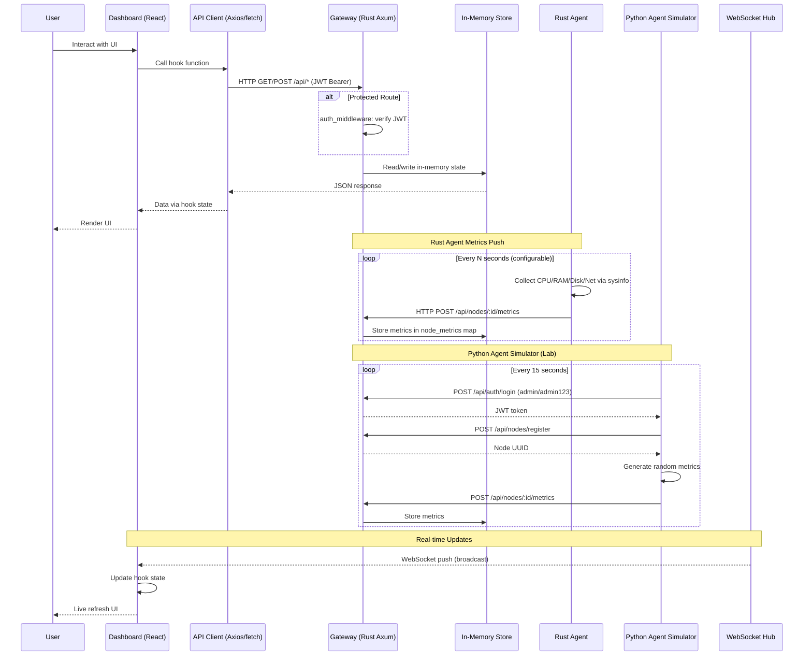

# NebulaGrid — Project Maps

## 1. PROJECT TREE MAP

### Dashboard (React + TypeScript + Tailwind)

| File Path | Role |
|---|---|
| `dashboard/package.json` | Project dependencies and scripts |
| `dashboard/src/main.tsx` | App entry point — React root, BrowserRouter, QueryClientProvider |
| `dashboard/src/App.tsx` | Route definitions — react-router with AuthGuard + AppLayout |
| `dashboard/src/index.css` | Tailwind CSS imports and custom styles |
| `dashboard/src/lib/auth.ts` | Zustand auth store — login/logout, localStorage token management |
| `dashboard/src/lib/api-client.ts` | Axios instance with JWT interceptor and 401 redirect |
| `dashboard/src/lib/ws.ts` | WebSocket client with reconnect, topic-based subscriptions |
| `dashboard/src/lib/constants.ts` | API_BASE_URL, WS_URL, ROLES constants |
| `dashboard/src/lib/utils.ts` | cn() helper (clsx + tailwind-merge), formatBytes, formatPercent |
| `dashboard/src/types/user.ts` | User type — id, username, email, roles |
| `dashboard/src/types/node.ts` | Node and NodeMetrics types |
| `dashboard/src/types/container.ts` | Container type — with ports array |
| `dashboard/src/types/vm.ts` | VirtualMachine and Snapshot types |
| `dashboard/src/types/kubernetes.ts` | K8sPod, K8sDeployment, K8sService, K8sNode types |
| `dashboard/src/types/metrics.ts` | MetricsSnapshot, MetricsHistory, MonitoringOverview, Alert types |
| `dashboard/src/hooks/useNodes.ts` | Nodes CRUD + node metrics fetch hook |
| `dashboard/src/hooks/useContainers.ts` | Containers list + single fetch hook |
| `dashboard/src/hooks/useVms.ts` | VMs CRUD + snapshots fetch hook |
| `dashboard/src/hooks/useKubernetes.ts` | K8s pods, deployments, services, nodes fetch hook |
| `dashboard/src/hooks/useMetrics.ts` | Monitoring overview, alerts, node metrics fetch hook |
| `dashboard/src/hooks/useWebSocket.ts` | WebSocket connection state + subscribe/unsubscribe hook |
| `dashboard/src/pages/Login.tsx` | Login form — posts to /auth/login, stores token |
| `dashboard/src/pages/Dashboard.tsx` | Dashboard — 4 stat cards, CPU/RAM placeholder charts |
| `dashboard/src/pages/Servers.tsx` | Servers list — empty state with install instructions |
| `dashboard/src/pages/ServerDetail.tsx` | Server detail — placeholder with ID display |
| `dashboard/src/pages/Containers.tsx` | Containers list — empty state |
| `dashboard/src/pages/ContainerDetail.tsx` | Container detail — uses useContainers, status/ports display |
| `dashboard/src/pages/Vms.tsx` | VMs list — empty state |
| `dashboard/src/pages/VmDetail.tsx` | VM detail — uses useVms, OS/CPU/RAM/Disk display |
| `dashboard/src/pages/Kubernetes.tsx` | Kubernetes — tabbed view (pods/deployments/services/nodes) |
| `dashboard/src/pages/Alerts.tsx` | Alerts — empty state |
| `dashboard/src/pages/Settings.tsx` | Settings — placeholder with profile section |
| `dashboard/src/pages/NotFound.tsx` | 404 page with link back to dashboard |
| `dashboard/src/components/layout/AppLayout.tsx` | Shell — Sidebar + Header + Outlet |
| `dashboard/src/components/layout/Sidebar.tsx` | Collapsible nav — Dashboard, Servers, Containers, VMs, Alerts, Settings |
| `dashboard/src/components/layout/Header.tsx` | Top bar — username display + logout button |
| `dashboard/src/components/guard/AuthGuard.tsx` | Redirects to /login if unauthenticated |
| `dashboard/src/components/charts/CpuChart.tsx` | Recharts line chart for CPU % |
| `dashboard/src/components/charts/RamChart.tsx` | Recharts line chart for RAM in GB |
| `dashboard/src/components/charts/DiskChart.tsx` | Recharts area chart for disk used/total |
| `dashboard/src/components/charts/NetworkChart.tsx` | Recharts line chart for network RX/TX |
| `dashboard/src/components/tables/NodeTable.tsx` | Node list table with status badges and resource bars |
| `dashboard/src/components/tables/ContainerTable.tsx` | Container list table with status/ports |
| `dashboard/src/components/tables/VmTable.tsx` | VM list table with OS/CPU/RAM/Disk columns |
| `dashboard/src/components/common/Badge.tsx` | Colored status badge (success/warning/danger/info/default) |
| `dashboard/src/components/common/Button.tsx` | Styled button with variants + loading spinner |
| `dashboard/src/components/common/Input.tsx` | Form input with label + error state |
| `dashboard/src/components/common/Modal.tsx` | Overlay modal with Escape-to-close |
| `dashboard/src/components/common/Spinner.tsx` | Animated loading spinner (sm/md/lg) |

### Agent (Rust — sysinfo collector + reporter)

| File Path | Role |
|---|---|
| `agent/src/main.rs` | Entry point — registers with gateway, collects + sends metrics loop |
| `agent/src/config.rs` | Clap CLI args: server, token, interval, grpc_port, no_docker, verbose |
| `agent/src/reporter.rs` | MetricsReporter — HTTP POST metrics to gateway /api/nodes/:id/metrics |
| `agent/src/grpc.rs` | Tonic gRPC server — RegisterAgent, ReportMetrics, ExecuteCommand |
| `agent/src/docker.rs` | DockerManager stub — connect, list_containers, get_logs |
| `agent/src/watcher.rs` | CommandWatcher stub — polls gateway for pending commands |
| `agent/src/collector/mod.rs` | MetricsSnapshot struct, SystemInfo struct, module declarations |
| `agent/src/collector/cpu.rs` | Reads global CPU usage via sysinfo |
| `agent/src/collector/memory.rs` | Reads total/used RAM + percent via sysinfo |
| `agent/src/collector/disk.rs` | Sums disk total/used/percent via sysinfo |
| `agent/src/collector/network.rs` | Sums network RX/TX bytes via sysinfo |
| `agent/src/collector/os.rs` | Reads hostname, OS name, kernel, architecture, CPU model |
| `agent/src/collector/process.rs` | Counts running processes via sysinfo |

### Control Plane — Gateway (Rust Axum)

| File Path | Role |
|---|---|
| `control-plane/gateway/src/main.rs` | Entry — creates router with CORS, tracing, graceful shutdown |
| `control-plane/gateway/src/config.rs` | Clap + env config: HTTP_PORT, GRPC_PORT, JWT_SECRET, DB/REDIS/NATS URLs |
| `control-plane/gateway/src/state.rs` | In-memory AppState — users, nodes, metrics, containers, vms, k8s, alerts, jobs |
| `control-plane/gateway/src/routes/mod.rs` | Route tree — public + protected groups with auth middleware |
| `control-plane/gateway/src/routes/auth.rs` | Login (Argon2 verify), refresh token, logout, me |
| `control-plane/gateway/src/routes/users.rs` | Users CRUD — list, get, create (Argon2 hash), update, delete |
| `control-plane/gateway/src/routes/nodes.rs` | Nodes CRUD + register + metrics history/latest + command |
| `control-plane/gateway/src/routes/containers.rs` | Containers list/detail + start/stop/restart/delete/logs |
| `control-plane/gateway/src/routes/vms.rs` | VMs CRUD + start/stop/restart + snapshot/backup |
| `control-plane/gateway/src/routes/kubernetes.rs` | K8s pods, deployments, services, nodes, namespaces |
| `control-plane/gateway/src/routes/metrics.rs` | Monitoring overview + Prometheus-compatible query endpoint |
| `control-plane/gateway/src/routes/alerts.rs` | Alerts list (with severity/ack filter) + acknowledge |
| `control-plane/gateway/src/middleware/auth.rs` | JWT Bearer token validation middleware |
| `control-plane/gateway/src/middleware/rbac.rs` | Role-based access control (Admin/Operator/Viewer) |
| `control-plane/gateway/src/middleware/logging.rs` | Request/response logging middleware |
| `control-plane/gateway/src/ws/hub.rs` | Broadcast channel hub for WebSocket topic pub/sub |
| `control-plane/gateway/src/ws/handler.rs` | WebSocket upgrade + metrics topic subscription |
| `control-plane/gateway/src/grpc/server.rs` | gRPC server configured for agent connections |
| `control-plane/gateway/src/tests/mod.rs` | Integration tests — health, login, auth-gated nodes |

### Control Plane — Migrations

| File Path | Role |
|---|---|
| `control-plane/migrations/001_initial.sql` | Schema: users, nodes, node_metrics, containers, vms, k8s_resources, alerts, jobs |

### Proto

| File Path | Role |
|---|---|
| `proto/agent.proto` | gRPC service def: RegisterAgent, ReportMetrics, ExecuteCommand, TransferFile, StreamLogs |
| `proto/common.proto` | Shared proto types: Empty, Error, Timestamp, NodeIdentifier |
| `proto/build.rs` | Prost build script — compiles proto/*.proto to Rust |

### Deployment

| File Path | Role |
|---|---|
| `deployment/docker-compose.yml` | Production Compose: postgres, redis, nats, gateway, dashboard |
| `deployment/docker-compose.dev.yml` | Dev overrides |
| `deployment/Dockerfile.gateway` | Multi-stage Rust build for gateway binary |
| `deployment/Dockerfile.agent` | Multi-stage Rust build for agent binary |
| `deployment/kubernetes/nebula-grid/Chart.yaml` | Helm chart metadata |
| `deployment/kubernetes/nebula-grid/values.yaml` | Helm values |
| `deployment/kubernetes/nebula-grid/templates/` | Helm K8s templates |
| `deployment/terraform/main.tf` | Terraform infra definition |
| `deployment/terraform/variables.tf` | Terraform variables |
| `deployment/terraform/outputs.tf` | Terraform outputs |

### Scripts

| File Path | Role |
|---|---|
| `scripts/install.sh` | Agent install script (Linux) |
| `scripts/setup-dev.sh` | Dev environment setup (Linux/macOS) |
| `scripts/setup-dev.ps1` | Dev environment setup (Windows) |
| `scripts/seed-data.sh` | Seed sample data script |
| `scripts/test-agents.sh` | Agent connectivity test script |
| `scripts/backup.sh` | Database backup script (Linux) |
| `scripts/backup.ps1` | Database backup script (Windows) |

### Docs

| File Path | Role |
|---|---|
| `docs/api.md` | API reference documentation |
| `docs/architecture.md` | Architecture overview |
| `docs/agent-install.md` | Agent installation guide |
| `docs/setup.md` | Setup instructions |
| `docs/screenshots/` | Application screenshots |

### Labs

| File Path | Role |
|---|---|---|
| `labs/docker-compose.lab.yml` | Local dev environment — 4 profiles: core, infra, agents, full |
| `labs/agent-simulator/simulator.py` | Python agent simulator — logs in, registers as node, sends metrics every 15s |
| `labs/agent-simulator/Dockerfile` | Docker image for agent simulator (Python 3 + requests) |
| `labs/agent-simulator/requirements.txt` | Python dependencies (requests) |

### Root

| File Path | Role |
|---|---|
| `.env.example` | Environment variable template |
| `.github/workflows/` | CI/CD workflow definitions |
| `README.md` | Project overview, quick start, architecture diagram |
| `README.md` | Project overview (labs MVP) |
| `CONTRIBUTING.md` | Contribution guide |
| `SECURITY.md` | Security policy |
| `CODE_OF_CONDUCT.md` | Community guidelines |

---

## 2. ROUTE MAP

### Health

| Method | Path | Handler File | Handler Function | Auth | Description |
|---|---|---|---|---|---|
| GET | `/api/health` | `main.rs` | `health_check` | No | Returns status "ok", version, uptime |
| GET | `/api/health/ready` | `main.rs` | `ready_check` | No | Returns status "ready", version, uptime |

### Authentication (Public)

| Method | Path | Handler File | Handler Function | Auth | Description |
|---|---|---|---|---|---|
| POST | `/api/auth/login` | `routes/auth.rs` | `login` | No | Authenticate with username/password, returns JWT + refresh token |
| POST | `/api/auth/refresh` | `routes/auth.rs` | `refresh` | No | Exchange refresh token for new JWT |

### Authentication (Protected)

| Method | Path | Handler File | Handler Function | Auth | Description |
|---|---|---|---|---|---|
| POST | `/api/auth/logout` | `routes/auth.rs` | `logout` | JWT | Clear refresh tokens |
| GET | `/api/auth/me` | `routes/auth.rs` | `me` | JWT | Get current user profile |

### Users

| Method | Path | Handler File | Handler Function | Auth | Description |
|---|---|---|---|---|---|
| GET | `/api/users` | `routes/users.rs` | `list` | JWT | List all users |
| POST | `/api/users` | `routes/users.rs` | `create` | JWT | Create new user |
| GET | `/api/users/:id` | `routes/users.rs` | `get_by_id` | JWT | Get user by UUID |
| PUT | `/api/users/:id` | `routes/users.rs` | `update` | JWT | Update user email |
| DELETE | `/api/users/:id` | `routes/users.rs` | `delete` | JWT | Delete user |

### Nodes

| Method | Path | Handler File | Handler Function | Auth | Description |
|---|---|---|---|---|---|
| GET | `/api/nodes` | `routes/nodes.rs` | `list` | JWT | List all registered nodes |
| POST | `/api/nodes/register` | `routes/nodes.rs` | `register` | JWT | Register a new node |
| GET | `/api/nodes/:id` | `routes/nodes.rs` | `get_by_id` | JWT | Get node by UUID |
| PUT | `/api/nodes/:id` | `routes/nodes.rs` | `update` | JWT | Update node hostname/status |
| DELETE | `/api/nodes/:id` | `routes/nodes.rs` | `delete` | JWT | Delete node |
| GET | `/api/nodes/:id/metrics` | `routes/nodes.rs` | `metrics_history` | JWT | Get node metrics history |
| GET | `/api/nodes/:id/metrics/latest` | `routes/nodes.rs` | `metrics_latest` | JWT | Get latest node metrics |
| POST | `/api/nodes/:id/command` | `routes/nodes.rs` | `execute_command` | JWT | Queue command for node |

### Containers

| Method | Path | Handler File | Handler Function | Auth | Description |
|---|---|---|---|---|---|
| GET | `/api/containers` | `routes/containers.rs` | `list` | JWT | List all containers |
| GET | `/api/containers/:id` | `routes/containers.rs` | `get_by_id` | JWT | Get container detail |
| POST | `/api/containers/:id/start` | `routes/containers.rs` | `start` | JWT | Start a stopped container |
| POST | `/api/containers/:id/stop` | `routes/containers.rs` | `stop` | JWT | Stop a running container |
| POST | `/api/containers/:id/restart` | `routes/containers.rs` | `restart` | JWT | Restart a container |
| GET | `/api/containers/:id/logs` | `routes/containers.rs` | `logs` | JWT | Get container logs (mock) |
| DELETE | `/api/containers/:id` | `routes/containers.rs` | `delete` | JWT | Delete container |

### Virtual Machines

| Method | Path | Handler File | Handler Function | Auth | Description |
|---|---|---|---|---|---|
| GET | `/api/vms` | `routes/vms.rs` | `list` | JWT | List all VMs |
| POST | `/api/vms` | `routes/vms.rs` | `create` | JWT | Create a new VM |
| GET | `/api/vms/:id` | `routes/vms.rs` | `get_by_id` | JWT | Get VM by UUID |
| PUT | `/api/vms/:id` | `routes/vms.rs` | `update` | JWT | Update VM name/cpu/ram/disk |
| DELETE | `/api/vms/:id` | `routes/vms.rs` | `delete` | JWT | Delete VM |
| POST | `/api/vms/:id/start` | `routes/vms.rs` | `start` | JWT | Start a stopped VM |
| POST | `/api/vms/:id/stop` | `routes/vms.rs` | `stop` | JWT | Stop a running VM |
| POST | `/api/vms/:id/restart` | `routes/vms.rs` | `restart` | JWT | Restart a VM |
| POST | `/api/vms/:id/snapshot` | `routes/vms.rs` | `create_snapshot` | JWT | Create VM snapshot |
| GET | `/api/vms/:id/snapshots` | `routes/vms.rs` | `list_snapshots` | JWT | List VM snapshots |
| POST | `/api/vms/:id/backup` | `routes/vms.rs` | `backup` | JWT | Initiate VM backup |

### Kubernetes

| Method | Path | Handler File | Handler Function | Auth | Description |
|---|---|---|---|---|---|
| GET | `/api/k8s/nodes` | `routes/kubernetes.rs` | `nodes` | JWT | List K8s cluster nodes |
| GET | `/api/k8s/pods` | `routes/kubernetes.rs` | `pods` | JWT | List K8s pods |
| GET | `/api/k8s/deployments` | `routes/kubernetes.rs` | `deployments` | JWT | List K8s deployments |
| GET | `/api/k8s/services` | `routes/kubernetes.rs` | `services` | JWT | List K8s services |
| GET | `/api/k8s/namespaces` | `routes/kubernetes.rs` | `namespaces` | JWT | List K8s namespaces |

### Monitoring

| Method | Path | Handler File | Handler Function | Auth | Description |
|---|---|---|---|---|---|
| GET | `/api/monitoring/overview` | `routes/metrics.rs` | `overview` | JWT | Aggregate metrics overview (node stats, avg CPU/RAM) |
| GET | `/api/monitoring/prometheus/query` | `routes/metrics.rs` | `prometheus_query` | JWT | Prometheus-compatible query adapter |
| GET | `/api/monitoring/alerts` | `routes/alerts.rs` | `list` | JWT | List alerts (filterable by severity/ack) |
| POST | `/api/monitoring/alerts/:id/ack` | `routes/alerts.rs` | `acknowledge` | JWT | Acknowledge an alert |

### WebSocket

| Method | Path | Handler File | Handler Function | Auth | Description |
|---|---|---|---|---|---|
| GET | `/ws` | `ws/handler.rs` | `ws_handler` | JWT (query) | WebSocket upgrade — subscribes to "metrics" topic broadcast |

---

## 3. DATA FLOW MAP

### Data Flow Explanation

- **User → Dashboard → API → Gateway**: User actions trigger React hooks that call the API client (Axios/fetch). The client includes the JWT token from localStorage. Requests hit the Gateway which validates the token via `auth_middleware`, performs the operation on the in-memory store, and returns JSON.

- **Agent → Gateway (metrics push)**: The NebulaGrid Agent runs on managed servers. Every N seconds (default 10), it collects system metrics (CPU, RAM, disk, network) via `sysinfo` and POSTs them to `/api/nodes/:id/metrics` on the Gateway. The Gateway stores them in the `node_metrics` HashMap keyed by node UUID.

- **Python Agent Simulator → Gateway (lab)**: The lab environment includes 3 Python agent simulators (`labs/agent-simulator/simulator.py`). Each simulator logs in via `POST /api/auth/login` with `admin/admin123` to obtain a JWT, registers as a new node via `POST /api/nodes/register`, then sends randomized CPU/RAM/Disk/Network metrics every 15 seconds via `POST /api/nodes/:id/metrics`. This simulates real agent behavior without requiring Rust compilation.

- **Gateway → Dashboard (WebSocket push)**: After storing metrics, the Gateway publishes them to a `WsHub` broadcast channel on the "metrics" topic. Connected WebSocket clients (the dashboard) receive the broadcast and update their hook state, providing real-time UI updates without polling.

- **In-Memory Store as single source of truth**: The Gateway's `AppState` holds all data (users, nodes, metrics, containers, VMs, K8s resources, alerts) in `Mutex<Vec<T>>` or `Mutex<HashMap<K,V>>` structures. PostgreSQL migrations exist (`001_initial.sql`) but the current implementation uses in-memory storage exclusively.

- **Agent registration flow**: On startup, the agent calls `POST /api/nodes/register` with its hostname, IP, OS info, and hardware specs. The gateway creates a `StoredNode` record and returns the assigned UUID. If registration fails, the agent falls back to a self-generated UUID. The Python simulators follow the same flow using JWT auth.

---

## 4. COMPONENT TREE

```mermaid
graph TD
    RB[BrowserRouter] --> QC[QueryClientProvider]
    QC --> App[App.tsx]
    App --> Routes

    subgraph Routes
        Login[LoginPage]
        AuthGuard[AuthGuard]
        NotFound[NotFoundPage]

        AuthGuard --> AL[AppLayout]
        AL --> Sidebar[Sidebar]
        AL --> Header[Header]
        AL --> Outlet

        Outlet --> DP[DashboardPage]
        Outlet --> SP[ServersPage]
        Outlet --> SDP[ServerDetailPage]
        Outlet --> CP[ContainersPage]
        Outlet --> CDP[ContainerDetailPage]
        Outlet --> VP[VmsPage]
        Outlet --> VDP[VmDetailPage]
        Outlet --> KP[KubernetesPage]
        Outlet --> AP[AlertsPage]
        Outlet --> SetP[SettingsPage]
    end

    subgraph Hooks
        useN[useNodes]
        useC[useContainers]
        useV[useVms]
        useK[useKubernetes]
        useM[useMetrics]
        useWS[useWebSocket]
        useA[useAuth]
    end

    subgraph Charts
        Cpu[CpuChart]
        Ram[RamChart]
        Disk[DiskChart]
        Net[NetworkChart]
    end

    subgraph Tables
        NT[NodeTable]
        CT[ContainerTable]
        VT[VmTable]
    end

    subgraph Common
        Badge[Badge]
        Button[Button]
        Input[Input]
        Modal[Modal]
        Spinner[Spinner]
    end

    subgraph Lib
        AC[api-client.ts]
        AuthStore[auth.ts]
        WS[ws.ts]
    end

    CDP --> useC
    VDP --> useV
    KP --> useK
    SDP --> useN

    DP -.-> Cpu
    DP -.-> Ram
    KP -.-> NT
    KP -.-> CT
    KP -.-> VT

    NT --> Badge
    CT --> Badge
    VT --> Badge
    Login --> Input
    Login --> Button
    Login --> AuthStore
    Login --> AC

    CDP --> Badge
    VDP --> Badge

    useWS --> WS
    AC --> AuthStore
```

### Component Hierarchy Notes

- **Router structure**: `BrowserRouter` wraps `QueryClientProvider` (react-query), which wraps `App`. The app defines a `<Routes>` block. The `/login` route is public. All other routes are nested under `<AuthGuard>` (redirects to `/login` if no token) and `<AppLayout>` (renders `Sidebar` + `Header` + `<Outlet>` for page content).
- **Page-to-hook mapping**: `ContainerDetailPage` uses `useContainers`, `VmDetailPage` uses `useVms`, `KubernetesPage` uses `useKubernetes`, `ServerDetailPage` structures exist for `useNodes`. `LoginPage` uses `useAuth` (Zustand store).
- **Charts/Tables**: Chart components (`CpuChart`, `RamChart`, `DiskChart`, `NetworkChart`) and table components (`NodeTable`, `ContainerTable`, `VmTable`) are available in component library for custom integrations. Badge is used by all three table components and by ContainerDetail/VmDetail pages.
- **Common components**: `Badge`, `Button`, `Input`, `Modal`, `Spinner` are shared primitives used across pages.
- **Auth flow**: `LoginPage` calls `api-client.post('/auth/login')`, then calls `useAuth.login(token, user)` which stores the token in localStorage and sets Zustand state. `api-client.ts` attaches the Bearer token via Axios interceptor. `AuthGuard` reads `isAuthenticated` from `useAuth`. The `ws.ts` client reads the token from localStorage for WebSocket auth.
